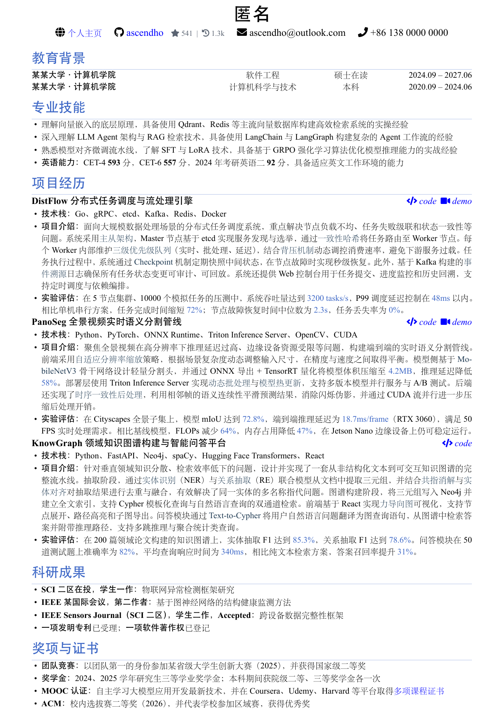

# LaTeX 简历模板

<div align="center">
  
</div>

面向国内技术从业者的现代简洁 LaTeX 简历模板。基于 XeLaTeX + ctexart，提供项目经历、教育背景、科研成果等自定义命令，支持 GitHub 统计数据自动获取。

## 环境要求

| 工具 | 用途 |
|------|------|
| XeLaTeX | PDF 编译（TeX Live / MiKTeX） |
| curl | GitHub API 请求（仅 stats 脚本需要） |
| jq | JSON 解析（仅 stats 脚本需要） |
| perl | 文本替换（仅 stats 脚本需要） |

**依赖的 LaTeX 宏包：** `ctex`、`fontawesome5`、`geometry`、`enumitem`、`titlesec`、`xcolor`、`hyperref`、`bookmark`、`eso-pic`

## 目录结构

```
template/         简历模版
  CV.tex          主 LaTeX 源文件
script/           辅助脚本
  update_github_stats.sh    Linux/macOS
  update_github_stats.ps1   Windows (PowerShell)
```

## 快速开始

1. **克隆**本仓库
2. **编辑** `template/CV.tex`，将示例内容替换为你自己的信息
3. **更新 GitHub 数据**（可选）：

```bash
# Linux/macOS
./script/update_github_stats.sh 你的GitHub用户名

# Windows (PowerShell)
.\script\update_github_stats.ps1 -Username 你的GitHub用户名
```

4. **编译** PDF：

```bash
cd template
xelatex CV.tex
xelatex CV.tex   # 运行两次以确保版式正确
```

编译生成的 `CV.pdf` 位于 `template/` 目录下。
