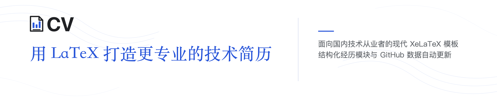
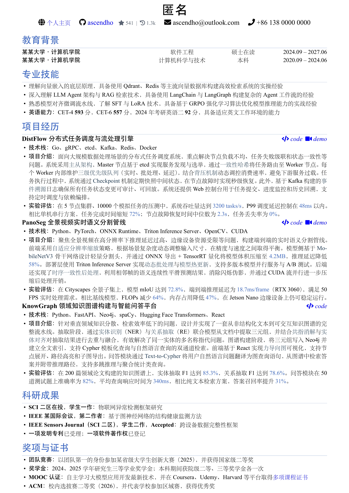

# LaTeX 简历模板

<div align="center">
  
</div>

<div align="center">


</div>

面向国内技术从业者的现代简洁 LaTeX 简历模板。项目基于 XeLaTeX 与 ctexart，提供教育背景、项目经历、科研成果等可复用模块，并支持自动获取 GitHub Star 与 Commit 统计数据。

## 简历预览

<div align="center">
  
</div>

## 环境要求

| 工具 | 用途 |
|------|------|
| XeLaTeX | PDF 编译（TeX Live / MiKTeX） |
| Python 3.8+ | GitHub 统计脚本（仅 stats 脚本需要，纯标准库、免装第三方依赖） |

**依赖的 LaTeX 宏包：** `ctex`、`fontawesome5`、`geometry`、`enumitem`、`titlesec`、`xcolor`、`hyperref`、`bookmark`、`eso-pic`

## 目录结构

```
template/         简历模板
  CV.tex          主 LaTeX 源文件
script/           辅助脚本
  update_github_stats.py    更新 GitHub 统计（Windows / macOS / Linux 通用）
assets/           静态资源
  CV-template.png           简历预览图
  cv-cover-zh-cn.png        README 中文封面
.env.example      GitHub Token 配置模板（复制为 .env 使用，不会被提交）
LICENSE           MIT 许可证
```

## 快速开始

1. **克隆**本仓库
2. **编辑** `template/CV.tex`，将示例内容替换为你自己的信息
3. **更新 GitHub 数据**（可选）：脚本会自动从 `CV.tex` 中检测你的 GitHub 用户名，也可以手动指定。

```bash
# 自动检测用户名（从 CV.tex 中提取）
python3 script/update_github_stats.py

# 或手动指定
python3 script/update_github_stats.py 你的GitHub用户名

# Windows (PowerShell / CMD) — 使用 python 而非 python3
python script\update_github_stats.py
```
> [!NOTE]
> 脚本需要访问 GitHub API。如果你在国内遇到 `无法连接 api.github.com` 等网络错误，可以使用 [Watt Toolkit](https://steampp.net/)（原 Steam++）等工具加速 GitHub 访问。

**提示：** GitHub API 匿名访问限额较低（约 10 次/分钟）。如果遇到限流报错，可以在仓库根目录创建 `.env` 文件配置 Token 提升限额（约 30 次/分钟）：

```bash
# 1. 复制模板并填入你的 Token（生成地址见下方折叠说明，无需勾选任何权限）
cp .env.example .env
echo "GITHUB_TOKEN=你的Token" >> .env

# 2. 正常运行脚本即可，脚本会自动读取 .env
```

<details>
<summary>如何生成 GitHub Token（点击展开）</summary>

GitHub → Settings → Developer settings → [Personal access tokens](https://github.com/settings/tokens) → Generate new token。

`.env` 已被 `.gitignore` 排除，不会被提交。也可以不建文件、临时用环境变量（`export GITHUB_TOKEN=xxx` / `$env:GITHUB_TOKEN = "xxx"`），环境变量优先级更高。注意 Token 等同于密码，不要提交进仓库或分享给他人。

</details>

4. **编译** PDF：

```bash
cd template
xelatex CV.tex
xelatex CV.tex   # 运行两次以确保版式正确
```

编译生成的 `CV.pdf` 位于 `template/` 目录下。

## 贡献

欢迎提交 Issue 和 Pull Request！

- 如果你有功能建议或发现了 bug，请提交 [Issue](https://github.com/ascendho/CV/issues)
- 如果你想贡献代码，请先 Fork 本仓库，修改后提交 PR
- 请确保 PR 描述清晰，说明修改的内容和原因

## 许可证

本项目使用 [MIT License](LICENSE)。
